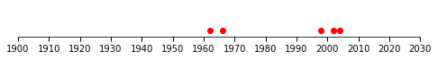

# Number line
 1. read the excel file "./Jahrestag.xlsx", and

    | date   | note       | age |
    |--------|------------|-----|
    |mm/dd/62|H...        |60   |
    |mm/dd/66|L...        |56   |
    |mm/dd/98|H...tag     |24   |
    |mm/dd/02|Ma...       |21   |
    |mm/dd/04|Mo...       |18   |

 2. generate a PNG that shows a number line of the dates' years

